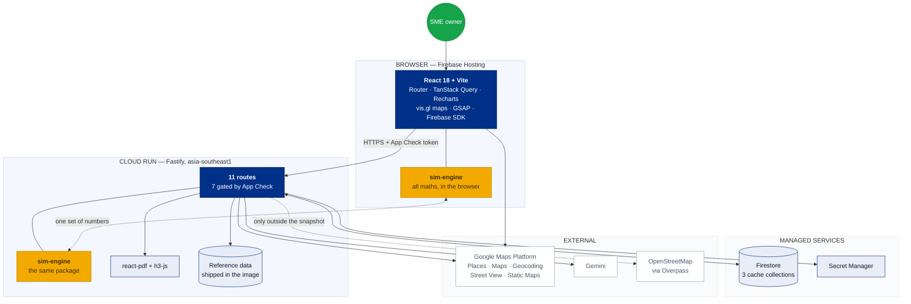
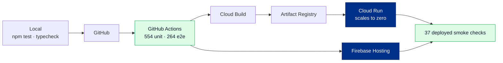

<div align="center">

# Spotential

**Location intelligence for Malaysian SMEs.**
Score a site before you sign the lease.

[](https://spotential-app.web.app)
[](#testing)
[](#tech-stack)
[](#infrastructure)

[Live app](https://spotential-app.web.app) · [Features](#what-it-does) · [Tech stack](#tech-stack) · [Data](#data-sources) · [Run it locally](#running-it-locally)

</div>

---

## The problem

Opening a shop in Malaysia usually comes down to instinct and a walk around the neighbourhood. The data that would answer *"is this a good spot?"* exists — census figures, competitor density, rental benchmarks, footfall generators — but it is scattered across government portals, mapping APIs and PDF reports, and none of it is in a form a small business owner can act on in an afternoon.

**Spotential pulls it into one place and turns it into a decision.** Drop a pin, pick a business type, and get a scored analysis of the site: who you would be competing with, how many people actually live within walking distance, what the rent implies for your break-even, and where the gaps are.

### What it is not

A forecast. The Success Score is a **comparison aid** — nothing in it has been validated against real business outcomes, every dimension declares whether it was measured or inferred, and the product refuses to state figures it cannot support. That restraint is a design goal, not a limitation. See [Principles](#principles).

---

## What it does

### Core features

| | Feature | What you get |
|---|---|---|
| 🎯 | **Location Analysis** | A pin, a category, a radius → an overall Success Score across five dimensions, with every figure traceable to its source |
| 🗺️ | **Map & Street View** | Interactive map with competitor pins, dual search rings, and Street View sharing the frame |
| 🏪 | **Competitor Analysis** | Who is already trading nearby — ratings, review volume, distance, price level, size-vs-rating scatter, density by distance ring |
| 👥 | **Demographics & Catchment** | District age and ethnicity mix, plus a **real walk-in catchment** measured from a 400 m population grid |
| 💰 | **Rental Market** | Curated per-district benchmarks, a quoted-rent override, and the one number that matters: *how many customers a day before you make a sen* |
| ⚖️ | **Comparison** | Two or three sites side by side on an overlaid radar, with per-dimension verdicts that say "too close to call" when they are |
| 💬 | **AI Chatbot** | Ask questions about the location in plain language, grounded on a deterministic fact sheet |
| 📄 | **PDF Report** | A six-page typeset document to take to a landlord or a bank |
| 🎪 | **Events Marketplace** | Browse bazaars, expos and markets ranked by an **Event Opportunity Score** for your business — with booth ROI answered as *what share of the crowd must buy before you break even* |

### Add-ons

| | Feature | What you get |
|---|---|---|
| 🔍 | **Opportunity Gap Detection** | Cross-references competitor saturation against demand per category to surface underserved niches — and returns *nothing* when everything is saturated |
| 🔥 | **City Demand Heatmap** | Population density across four cities as a real kernel-density heat surface, calibrated to a national scale so a shade means the same thing in every city — with click-to-inspect cells, ranked neighbourhoods, transit/mall/campus overlays and rent benchmarks on one map |
| 📊 | **What-if Simulator** | Editable inputs → instant revenue, expenses, profit, three break-evens, a 24-month cash curve and the cash trough you must fund before opening. Ask it *"what if demand drops 20%?"* in plain English |

**Fifteen business categories across three sectors.** *F&B* — Korean restaurant · Café / coffee shop · Casual dining · Bubble tea & dessert · Fast casual / takeaway · Other F&B. *Retail* — Clothing & fashion · Convenience store · Pharmacy & health · Phone & electronics · Other retail. *Services* — Salon & barber · Laundry · Fitness studio · Other services. Each sector carries its own cost norms, Places types and tax treatment: service tax follows dine-in, so it is correctly zero for a shop.

---

## Tech stack

### Frontend

| Technology | Role |
|---|---|
| **React 18** + **TypeScript** | UI, strict mode throughout |
| **Vite** | Build tool and dev server — a client-side app, not Next.js: this is a logged-in tool, not a content site, so there is no SEO reason to pay for SSR |
| **React Router 7** | Routing across Analysis, Comparison, Heatmap and Simulator |
| **TanStack Query 5** | Server state, caching and request de-duplication |
| **Recharts 2** | Competitor scatter plot and the on-screen radar |
| **GSAP 3 + @gsap/react** | Navigation motion — entrance, hover feedback and the pill that slides between active links. `useGSAP` scopes every tween to the component and reverts it on unmount |
| **@vis.gl/react-google-maps** | Google's own React wrapper for the Maps JavaScript API — maps, pins, radius circles, hexagon overlays |
| **Plain CSS** | Design tokens and hand-written CSS. No framework, no runtime styling cost |
| **Firebase JS SDK** | Anonymous auth and App Check attestation |

### Backend

| Technology | Role |
|---|---|
| **Node.js 22** | Runtime (uses the built-in `node:sqlite` in tooling) |
| **Fastify 5** | HTTP service — 11 routes, 7 of them attestation-gated |
| **TypeScript** | Strict, across all three workspaces |
| **esbuild** | Bundles the service to a single file for a distroless image |
| **@react-pdf/renderer** | PDF generation — chosen over Puppeteer to avoid a ~400 MB Chromium layer and 5–10 s cold starts |
| **h3-js** | Uber's H3 geospatial indexing, server-side, for exact hexagon geometry |
| **jose** | App Check JWT verification against Google's JWKS |

### Database & storage

| Technology | Role |
|---|---|
| **Cloud Firestore** (Native) | Three cache collections — `competitorSearches` (7-day TTL), `propertyListings` (24 h), `cityAmenities` (7-day) |
| **Versioned files in the container** | Reference data ships in the image rather than a database: population grid, district polygons, amenity snapshot |
| **Secret Manager** | API keys, mounted as `secretKeyRef` — never env literals, never in the bundle |
| **No Cloud SQL / PostGIS** | Considered and deliberately not provisioned — see [Cost](#cost) |
| **No Cloud Storage** | PDFs stream straight back to the caller rather than sitting in a bucket |

### APIs

| API | Used for |
|---|---|
| **Google Places API (New)** | Nearby competitor search — server-side only, minimal field mask, aggressively cached |
| **Google Maps JavaScript API** | Interactive maps |
| **Google Geocoding API** | Address → coordinates |
| **Google Street View Static API** | Street-level imagery |
| **Google Static Maps API** | The map embedded in PDF reports |
| **Google Gemini** | Natural-language questions and narrative write-ups — `gemini-3.6-flash` for routing, `gemini-3.1-pro-preview` for analysis |
| **Overpass API** (OpenStreetMap) | Points of interest — fetched into a versioned snapshot, not queried per page load |

### Infrastructure

| Service | Role |
|---|---|
| **Cloud Run** | Container backend, scales to zero, `asia-southeast1` |
| **Firebase Hosting** | Static frontend |
| **Cloud Build** | Container builds from `cloudbuild.yaml` |
| **Artifact Registry** | Image storage |
| **Firebase App Check** | reCAPTCHA Enterprise attestation on every route that reaches an external service |
| **Firebase Authentication** | Anonymous sign-in, used as a quota hint |
| **GitHub Actions** | CI — typecheck, unit, E2E, deployed smoke checks |

### Testing

| Tool | Role |
|---|---|
| **Vitest** | 554 unit and integration tests, including hand-verified golden vectors |
| **Playwright** | 264 end-to-end tests across desktop and mobile viewports |
| **Deployed smoke checks** | 37 assertions run against the live service after every deploy |

---

## Data sources

Every dataset is free and openly licensed. **Attribution is a licence condition and is rendered in the UI, not buried here.**

| Dataset | Provider | Licence | Vintage | Used for |
|---|---|---|---|---|
| **Population grid** | [Kontur Population](https://data.humdata.org/dataset/kontur-population-malaysia) via HDX | CC BY 4.0 | 2023-11-01 | 147,936 H3 hexagons at 400 m — walk-in catchments and the city heatmap |
| **District population** | [DOSM](https://storage.dosm.gov.my/population/population_district.csv) | CC BY 4.0 | 2025 | Age and ethnicity mix for 160 districts |
| **District boundaries** | [geoBoundaries](https://github.com/wmgeolab/geoBoundaries) ADM2 | CC BY 3.0 | 2026-08-12 | Point-in-polygon district resolution (159 features) |
| **Points of interest** | [OpenStreetMap](https://www.openstreetmap.org/) via Overpass | ODbL | 2026-08-13 | Transit, malls, campuses, hospitals — demand generators |
| **Rental benchmarks** | Curated research | — | Reviewed 2026-08 | 23 F&B trading areas across KL, Selangor, Penang and Johor |

> **Why rents are constants, not a feed.** Malaysia publishes no transacted retail rent in machine-readable form. NAPIC holds the data but sells it as twice-yearly PDFs; DOSM publishes only a state-level residential index. Listing portals quote *asking* prices and forbid automated collection. So the benchmarks are versioned constants in code, each carrying a source note, an applicable radius and a review date — and always beaten by a real figure the user types in.

---

## Architecture

An **npm workspaces monorepo** with three packages:

```
spotential/
├── packages/sim-engine/     Pure TypeScript. Zero runtime dependencies.
│                            Every calculation, score and geo operation.
├── apps/web/                React + Vite frontend.
└── services/simulator/      Fastify service on Cloud Run.
```

**The shared engine is the point.** `sim-engine` has no dependencies and is imported by *both* the browser and Cloud Run, so client/server agreement is not something to test for — it is a tautology. The PDF recomputes every figure through the same engine, which is what makes the document and the screen provably agree.

The service holds only what cannot run in a browser: paid API calls, caching, secrets and PDF rendering.

### How it all connects



**Reading it:** the browser computes its own numbers instantly and only calls the service for things it cannot do — paid lookups, caching, secrets and PDF rendering. The two gold boxes are the *same package*, which is why the screen, the API and the PDF can never disagree.

### Build and deploy



Tests gate the deploy, and the smoke checks run against the **live** service afterwards — `/health` reports which backend every subsystem actually resolved to, so a silent downgrade fails a check rather than showing up on next month's bill.

---

## Principles

The rules the codebase is actually built around.

**🔒 The AI never does arithmetic.** Gemini turns free-form questions into structured parameter changes; a deterministic engine computes every number and Gemini only narrates the result. Where prose has no enforceable shape, a numeric guard checks every figure in an answer against the fact sheet and **refuses** any answer citing a number the panels did not produce. A refusal is a bad answer; an invented figure presented as a measurement is an unrecoverable one.

**📊 Missing data is never zero.** A dimension with no data is excluded from the score and drawn as a gap, not plotted at zero. A distance ring that was never searched says *"not searched"* rather than `0`. An unknown and an empty street are different findings.

**🎯 Every figure declares its basis.** Measured, inferred, or unavailable — shown next to the number, and weights reflect how far a signal can be trusted rather than how much it "should" matter.

**💸 Cost is a design constraint.** The whole product runs inside a **MYR 45/month** budget. Features that could not fit were redesigned rather than shipped expensive — the heatmap was rebuilt on free population data after the original design priced at 11× the budget.

**📄 Caveats travel with the document.** The PDF outlives the screen it came from, so it carries a disclosures page with statutory rates, review dates, data provenance and the engine version — impossible to detach.

---

## Running it locally

**Prerequisites:** Node.js 22+, and a Google Maps API key if you want maps to render.

```bash
git clone https://github.com/HAIZ4D/spotential.git
cd spotential
npm install
```

Create `apps/web/.env.local` (see `apps/web/.env.example`):

```bash
VITE_SIMULATOR_URL=http://localhost:8080
VITE_GOOGLE_MAPS_API_KEY=your-browser-key
```

Run the backend and frontend in two terminals:

```bash
npm run dev:service                    # Fastify on :8080
npm run dev --workspace @spotential/web  # Vite on :5173
```

The simulator works entirely in-browser and needs no keys at all. Competitor search needs a Places key on the service; without one it serves cached results and says so.

### Commands

```bash
npm test            # unit + integration
npm run test:e2e    # Playwright, desktop + mobile, against a production build
npm run typecheck   # all three workspaces, strict
npm run test:parity # client/server parity + deployed smoke checks
```

---

## Testing

| Suite | Count | What it covers |
|---|---|---|
| **Unit & integration** | 554 | Golden vectors, property-based tests, schema validation, API contracts, chart geometry |
| **End-to-end** | 264 | Real production build, desktop and mobile, every route |
| **Deployed smoke** | 37 | Run against the live service — backend resolution, PDF rendering, App Check gating |

Financial and scoring logic is pinned with **hand-verified golden vectors**, not tests written against whatever the code happened to output. A formula regression fails loudly rather than being "fixed" by updating the expected value.

CI never calls Google Maps, Places or Overpass — every E2E blocks them and asserts graceful degradation.

---

## Cost

Designed to run at **under MYR 45/month (~USD 10)**, and it does:

- **Cloud Run** scales to zero — no traffic, no charge
- **Firebase Hosting** is free at this volume
- **Firestore** sits inside the free tier with aggressive caching
- **Places** is the expensive one: server-side only, minimal field mask, coordinates rounded, radii bucketed, 7-day cache, and a daily ceiling on uncached calls
- **No Cloud SQL** — it bills continuously whether used or not, so the heatmap was built on free population data instead
- **All datasets are free** and openly licensed

A GCP billing budget with alerts at 25/50/90/100% guards the rest.

---

## Status

Every feature in the spec is built, deployed and reachable in production.

**Known limitations, stated plainly:**

- The Success Score has **not been validated against real business outcomes**. It is a comparison aid.
- Google Places caps at 20 results per search, so competitor counts at dense addresses are a **floor, not a total** — and the UI says so wherever it matters.
- Rental benchmarks cover **23 trading areas**, not the whole country. An uncovered location gets an empty axis rather than a borrowed number.
- District demographics describe an administrative district, which is far larger than a walk-in catchment. The catchment figure is separate and measured.

---

## Disclaimer

Spotential produces **projections from stated inputs, not financial advice**. Statutory rates (EPF, SOCSO, EIS, service tax) are versioned constants with review dates — confirm them against KWSP, PERKESO and RMCD before relying on them. Nothing here has been validated against real business outcomes.

## License

No licence file is present, so all rights are reserved by default. Third-party data remains under its own terms — see [Data sources](#data-sources) for the attribution each dataset requires.

<div align="center">

---

Built for Malaysian small business owners.

</div>
